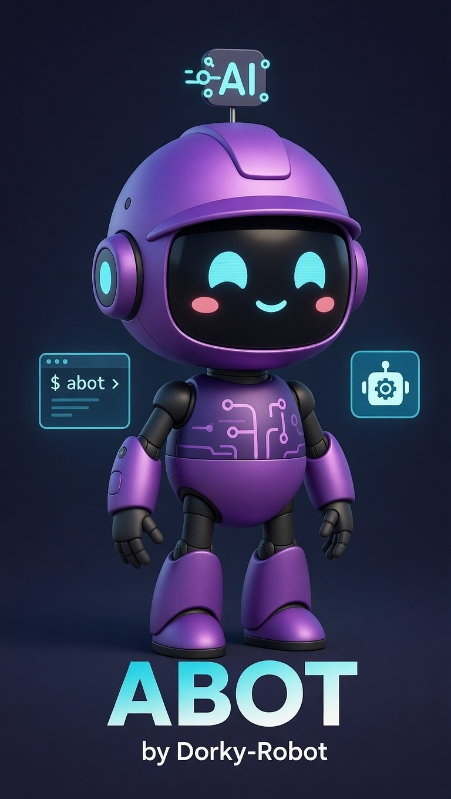

# abot

[](https://discord.gg/QSdjPhbU)

<div align="center">



*Intelligence within reach.*

</div>

A spatial terminal interface served by a single Rust binary. Multiple persistent shell sessions rendered as floating facets in the browser, accessible from any device.

## Why "abot"?

Your terminal is powerful, but it's flat. One session, one screen, one device. You can tile windows or use tmux, but the abstraction is always the same: a grid of characters in a rectangle.

abot takes a different approach. Your terminal sessions become **facets** — translucent floating panels arranged spatially in a canvas. Open three terminals side by side on your desktop. Walk to the kitchen and check them from your phone. Close the browser, come back tomorrow — every session is still there, scrollback intact.

The name is short for what it is: **a bot** — a small, helpful machine that sits between you and your shells, making them spatial, persistent, and portable.

## The idea

Katulong proved that a daemon-owned terminal over WebSocket works. abot takes those patterns — passkey auth, session persistence, rolling updates, touch-first design — and expands the surface from a single terminal to a spatial workspace.

```
Phone browser  ──WebSocket──┐
                              ├── Server (HTTP/WS) ──Unix Socket──  Daemon
Desktop browser ──WebSocket──┘   Auth, assets, routing                PTY sessions
                                                                      Ring buffers
WebRTC DataChannel ──P2P─────────────────────────────────────────────┘
```

The daemon owns all PTY sessions. The server is stateless — restart it, swap the binary, your sessions survive. The browser reconnects and the daemon replays the output buffer. You pick up exactly where you left off.

## Features

### Spatial multi-session UI
- **Facets** — Each terminal is a floating, translucent panel. Drag, resize, focus, and arrange them spatially.
- **Focus-based routing** — Input goes to the focused facet. No manual session switching.
- **Canvas-rendered** — Everything draws on `<canvas>`. DOM only for xterm.js, IME input, and clipboard.

### Session persistence
- **Sessions survive restarts** — The daemon process owns PTYs independently of the server.
- **Rolling zero-downtime updates** — `abot update` swaps the server binary while the daemon keeps sessions alive. Clients reconnect automatically.
- **Ring buffer replay** — Each session keeps a 5,000-item scrollback buffer. New clients get the full history on attach.

### Security
- **Passkey auth (WebAuthn)** — No passwords. Register with Touch ID, Face ID, or Windows Hello.
- **Localhost auto-auth** — Triple-validated loopback bypass (socket addr + Host header + Origin header).
- **Setup tokens** — Argon2-hashed, 24h TTL, for adding passkeys from remote devices.
- **Brute-force lockout** — 5 failures in 15 minutes triggers a 15-minute lockout.
- **CSRF protection** — Tokens injected at serve time, constant-time comparison.

### Touch-first
- **PWA-ready** — Install as a full-screen app from any browser.
- **Virtual keyboard** — On-screen keys for Ctrl, Tab, arrow keys.
- **Joystick navigation** — Touch joystick for scrolling.
- **Dictation** — Voice input via the browser's speech-to-text.

### WebRTC (P2P)
The server implements a WebRTC DataChannel peer. When a browser on the same LAN offers a P2P connection, terminal I/O routes over the DataChannel for lower latency, falling back to WebSocket when P2P isn't available.

### Docker isolation (optional)
With the `docker` feature flag, each session runs in its own container:
- 512MB RAM, 50% CPU, 256 PIDs, no network, dropped capabilities
- Runs as uid 1000 in an `abot-session` image with common dev tools
- Sessions persist across container restarts

## Install

### Homebrew (macOS)

```bash
brew tap dorky-robot/abot
brew install abot

abot start
```

### From source (Rust toolchain required)

```bash
git clone https://github.com/dorky-robot/abot.git
cd abot
cargo build --release
# Binary at: target/release/abot
```

## Quick start

```bash
abot start        # Start daemon + server (default: port 6969)
abot serve        # Server only (daemon must already be running)
abot daemon       # Daemon only
abot update       # Rolling update: swap binary, restart server, keep sessions
```

Open `http://localhost:6969` in a browser. Register a passkey on first visit. Create sessions. Arrange them. Close the browser. Come back. Everything is still there.

## Architecture

### Daemon / server split

```
abot start
  ├── abot daemon     PTY session owner, Unix socket IPC (NDJSON)
  │                    ~/.abot/daemon.sock
  │
  └── abot serve      HTTP/WS server, connects to daemon
                       Embeds client assets via rust-embed
```

The daemon is the long-lived process. The server is disposable. `abot update` sends SIGTERM to the old server, waits for it to drain, starts the new one. The daemon never restarts.

### Module layout

```
src/
├── daemon/          PTY sessions, ring buffer, NDJSON IPC, backend abstraction
├── server/          HTTP routes, asset serving, daemon client, config
├── auth/            WebAuthn, sessions, setup tokens, lockout, middleware
├── stream/          WebSocket handler, client tracking, message protocol, WebRTC
├── main.rs          CLI entry point (clap), subcommand dispatch
├── pid.rs           PID file management
└── error.rs         Shared error types

client/              Vanilla JS, 34 ES modules, zero build step, zero framework
```

### WebSocket protocol

```
→ { type: "session.create", ... }
← { type: "session.created", id: "..." }
→ { type: "session.attach", id: "..." }
← { type: "session.output", id: "...", data: "..." }
→ { type: "session.input", id: "...", data: "..." }
→ { type: "session.resize", id: "...", cols: 80, rows: 24 }
← { type: "server.draining" }        // Rolling update
→ { type: "p2p.signal", ... }        // WebRTC signaling
```

### REST API

| Method | Endpoint | Description |
|--------|----------|-------------|
| GET | `/sessions` | List all sessions |
| POST | `/sessions` | Create a session |
| PUT | `/sessions/:name` | Rename a session |
| DELETE | `/sessions/:name` | Destroy a session |
| GET | `/shortcuts` | Get shortcut config |
| PUT | `/shortcuts` | Update shortcut config |
| GET | `/health` | Health check |
| GET | `/api/config` | Instance configuration |

### Data directory

```
~/.abot/
├── daemon.sock       Unix domain socket (daemon IPC)
├── daemon.pid        Daemon PID file
├── server.pid        Server PID file
├── daemon.log        Daemon stdout/stderr
├── abot.db           SQLite (credentials, sessions, tokens)
├── config.json       Instance name, icon, toolbar color
└── shortcuts.json    User-defined keyboard shortcuts
```

## Self-provisioning

All sessions run in Docker containers for isolation:

```
Docker required
  → Web server + client + passkey auth
  → Sessions run in isolated containers
  → Resource limits, capability dropping, uid isolation
```

## Part of the dorky robot stack

- [katulong](https://github.com/Dorky-Robot/katulong) — Self-hosted web terminal (abot's predecessor)
- [sipag](https://github.com/Dorky-Robot/sipag) — Autonomous dev agents that evolve with your project
- [kubo](https://github.com/Dorky-Robot/kubo) — Chain-of-thought reasoning
- [tao](https://github.com/Dorky-Robot/tao) — Decision ledger

## Development

```bash
cargo run -- start       # Start daemon + server
cargo run -- serve       # Server only (daemon must be running)
cargo test               # Run tests
docker build -t abot-session -f Dockerfile.session .  # Build session image
```

## Status

> **Under active development.** APIs, protocols, and the client UI may change without notice.

The Rust backend is functional with auth, multi-session management, WebRTC, Docker isolation, and rolling updates. The Flutter Web client is the primary UI. See [BRAINSTORM.md](BRAINSTORM.md) for the full vision.

## License

MIT
